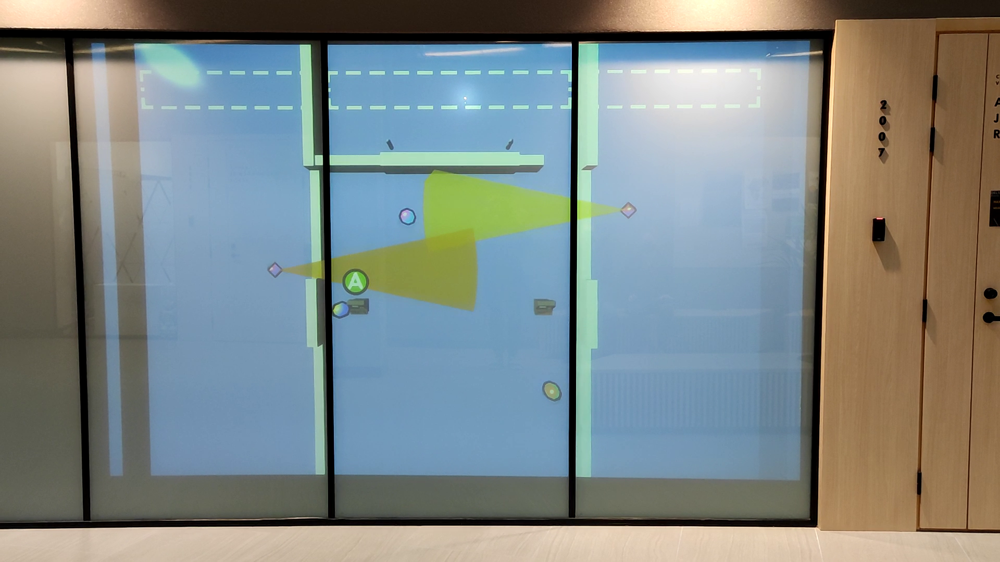

# SIGINT
A local co-op puzzle game made with the Godot game engine. The game was designed to be played on a Raspberry Pi 4 by 2-4 people using wireless controllers.

---

The game can be played on [itch.io](https://mattiasa.itch.io/sigint "Play the game or download builds") in a web browser which supports [WebGL](https://get.webgl.org/).
Windows, Linux, Mac, and Raspberry Pi builds are also available for download there.
